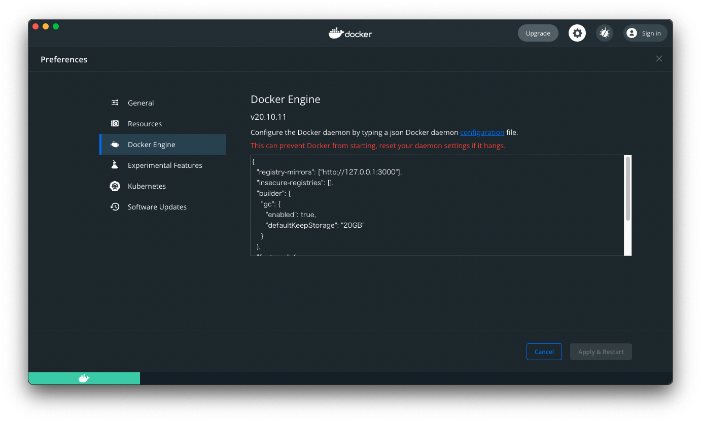

# docker-mirror

Build a mirror of DockerHub.

The storage is S3.

## Usage

1. Please add the following to your Docker deamon configuration

```json
{
  "registry-mirrors": ["http://127.0.0.1:3000"],
  "insecure-registries": [],
  ...
}
```



2. Start up the container.

```sh
docker compose build
docker compose up
```

3. Get the Nginx image as a sample.

```sh
docker pull nginx:latest
```
